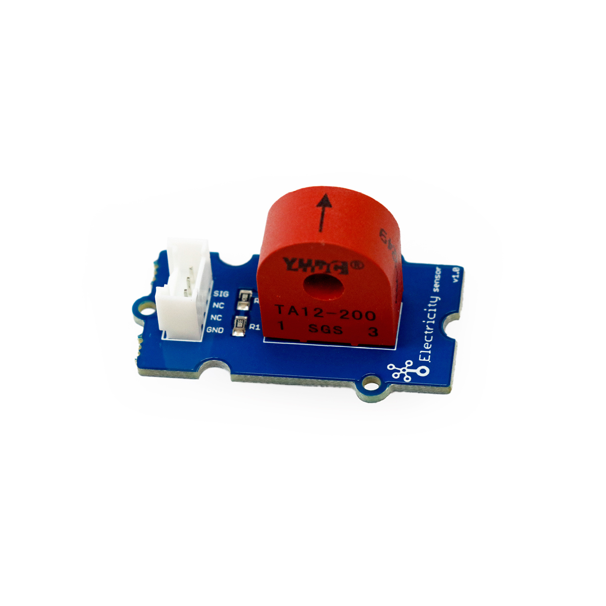

# Stromsensor

## Beschreibung
Der Stromsensor misst die Wechselstromstärke eines Kabels. Ein Stromwandler wandelt eine hohe Wechselstromstärke in eine minimale um. Durch die interne Verschaltung wird schließlich über einen analogen Anschluss eine analoge Spannung ausgegeben, die proportional zur gemessenen Stromstärke ist. Die maximal messbare Stromstärke liegt bei 5 Ampere. Der Sensor kann direkt oder mithilfe des Grove Shields an einen analogen Pindes Arduinos angeschlossen werden.

Das Modul kann beispielsweise zum Überwachen des Stromverbrauchs eines Geräts eingesetzt werden.

Alle weiteren Hintergrundinformationen sowie ein Beispielaufbau und alle notwendigen Programmbibliotheken sind auf dem offiziellen Wiki (bisher nur in englischer Sprache) von Seeed Studio zusammengefasst. Zusätzlich findet man über alle gängigen Suchmaschinen durch die Eingabe der genauen Komponentenbezeichnung entsprechende Projektbeispiele und Tutorials.

Die genaue Bezeichnung des Stromwandlers, die bei der Suche von Beschreibungen und Anleitungen wichtig sein kann, lautet TA12-200.

<!-- infolist -->

<!-- infolists -->
## Wichtige Links für die ersten Schritte:

- [Seeed Studio Wiki](http://wiki.seeedstudio.com/Grove-Electricity_Sensor/) [- Stromsensor](http://wiki.seeedstudio.com/Grove-Electricity_Sensor/)

## Projektbeispiele:

- [Hackster - AC Stromsensor](https://www.hackster.io/ingo-lohs/ac-current-sensor-182aff)  (Achtung: Hier wurde ein Sensor mit anderem Messverhältnis eingesetzt.)
- [Henry’s Bench - AC Stromsensor](http://henrysbench.capnfatz.com/henrys-bench/arduino-current-measurements/ta12-100-arduino-ac-current-sensor-tutorial/) (Achtung: Hier wurde ein Sensor mit anderem Messverhältnis eingesetzt.)

## Weiterführende Hintergrundinformationen:

- [TA12-200 - Datenblatt](http://www.electronicoscaldas.com/datasheet/TA12-TA12L-Series_YHDC.pdf)
- [Wechselstrom - Wikipedia Artikel](https://de.wikipedia.org/wiki/Wechselstrom)
- [Gleichstrom - Wikipedia Artikel](https://de.wikipedia.org/wiki/Gleichstrom)
- [GPIO - Wikipedia Artikel](https://de.wikipedia.org/wiki/Allzweckeingabe/-ausgabe)
- [GitHub-Repository: Stromsensor](https://github.com/MakeYourSchool/26-Stromsensor)

